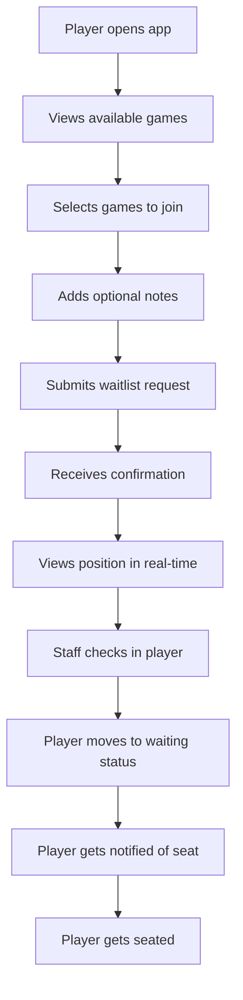
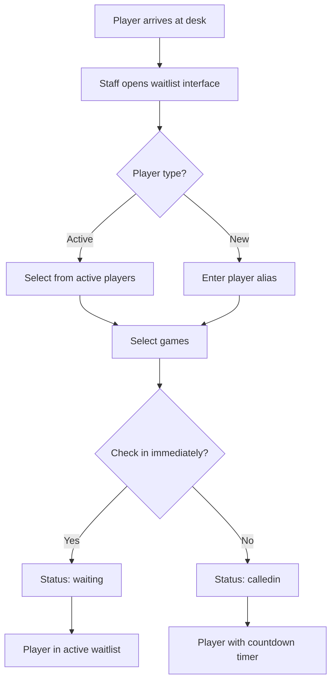
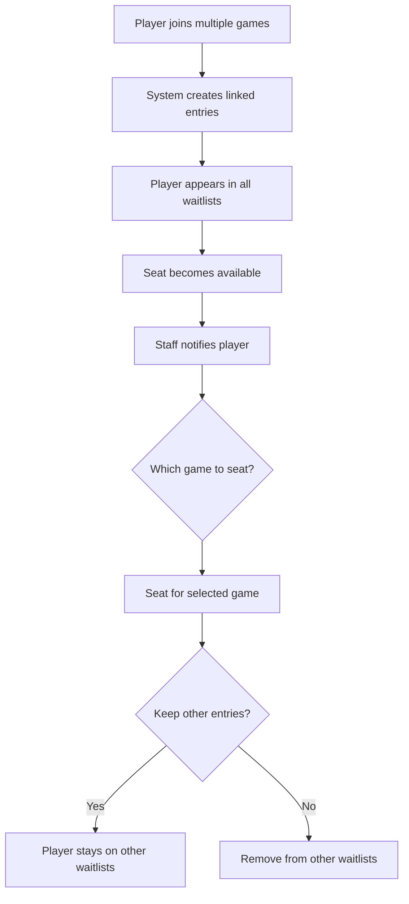
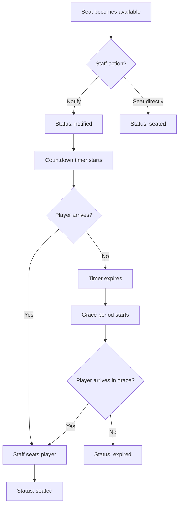

# Waitlist Workflow Documentation

## Overview

This document provides detailed workflow documentation for the waitlist management system, covering all user scenarios and system processes.

## User Workflows

### 1. Remote Call-in Workflow (Player Mobile App)

#### Step-by-Step Process

1. **Player Opens Mobile App**
   - Player navigates to room page
   - Views available games and current waitlist status
   - Sees estimated wait times for each game

2. **Player Selects Games**
   - Player can select multiple games to join waitlist
   - System shows current position for each game
   - Player can add optional notes

3. **Player Submits Waitlist Request**
   - System creates waitlist entry with status `calledin`
   - Player receives confirmation with estimated wait time
   - Player can view their position in real-time

4. **Staff Notification**
   - Staff receives notification of new call-in
   - Player appears in waitlist with "Call-in" indicator
   - Countdown timer starts (90 minutes default)

5. **Staff Actions**
   - **Check In**: Staff clicks "Check In" button
     - Status changes to `waiting`
     - Player moves to active waitlist
     - Countdown timer stops
   - **Cancel**: Staff clicks "Cancel" button
     - Status changes to `cancelled`
     - Player removed from waitlist
     - Player receives notification

6. **Expiry Handling**
   - If not checked in within time limit:
     - Status automatically changes to `expired`
     - Player moved to voided section
     - Reason: "Did not check in (called in)"

#### UI Flow



### 2. In-person Check-in Workflow (Staff at Poker Desk)

#### Step-by-Step Process

1. **Player Arrives at Poker Desk**
   - Player approaches staff member
   - Staff opens waitlist management interface

2. **Staff Searches for Player**
   - **Active Player**: Staff toggles to "Select Player" mode
     - System shows dropdown of active players
     - Staff selects player from list
   - **New Player**: Staff toggles to "Enter Alias" mode
     - Staff enters player alias
     - System creates new player record

3. **Staff Selects Games**
   - Staff selects one or more games
   - System shows current waitlist position for each game
   - Staff can add notes

4. **Check-in Options**
   - **Immediate Check-in**: Staff checks "Check in immediately"
     - Status set to `waiting`
     - Player appears in active waitlist
   - **Deferred Check-in**: Staff leaves unchecked
     - Status set to `calledin`
     - Player appears with countdown timer

5. **Staff Actions**
   - Same as remote call-in workflow
   - Can seat player immediately if seat available

#### UI Flow



### 3. Multi-game Player Workflow

#### Scenario: Player Joins Multiple Games

1. **Player Joins Multiple Games**
   - Player selects multiple games from available options
   - System creates separate waitlist entries for each game
   - System links entries in `other_game_entries` array

2. **Player Appears in Multiple Waitlists**
   - Player shows "Multi-game" indicator
   - Staff can see all games player is waiting for
   - System tracks position in each game

3. **Seat Becomes Available**
   - Staff notifies player for any of their games
   - Player can choose which game to play
   - Staff seats player for selected game

4. **Seating Options**
   - **Keep Other Entries**: Player stays on other waitlists
     - Player can play current game while waiting for preferred game
   - **Remove Other Entries**: Player removed from other waitlists
     - Player focuses on current game only

#### UI Flow



### 4. Notification and Seating Workflow

#### Step-by-Step Process

1. **Seat Becomes Available**
   - System identifies next player in queue
   - Staff can choose to notify or seat directly

2. **Notification Process**
   - Staff clicks "Notify" button
   - Status changes to `notified`
   - Countdown timer starts (5 minutes default)
   - Player receives notification (if implemented)

3. **Player Response**
   - **Player Arrives**: Staff clicks "Seat" button
     - Status changes to `seated`
     - Player assigned to table and seat
     - Player removed from waitlist
   - **Player Doesn't Arrive**: Timer expires
     - Status changes to `expired`
     - Player moved to voided section
     - Reason: "Did not show (notified)"

4. **Grace Period**
   - Additional 2 minutes after notification expiry
   - Player can still be seated if they arrive
   - Staff can manually extend grace period

#### UI Flow



## System Workflows

### 1. Automatic Expiry Processing

#### Background Job Process

1. **Scheduled Execution**
   - Job runs every minute
   - Processes all rooms with active waitlists

2. **Called-in Entry Expiry**
   - Find entries with status `calledin`
   - Check if `created_at` exceeds `call_in_expiry_minutes`
   - Update status to `expired`
   - Set `cancelled_by` to `system`
   - Set `cancelled_at` timestamp

3. **Notified Entry Expiry**
   - Find entries with status `notified`
   - Check if `notified_at` exceeds `notify_expiry_minutes + grace_period_minutes`
   - Update status to `expired`
   - Set `cancelled_by` to `system`
   - Set `cancelled_at` timestamp

4. **Cleanup and Notifications**
   - Move expired entries to voided section
   - Send notifications to staff (if configured)
   - Log expiry events for audit

#### Code Example

```typescript
const processExpiredEntries = async (roomId: string): Promise<void> => {
  const settings = await getRoomSettings(roomId)
  const now = new Date()

  // Process called-in entries
  const calledInExpiry = new Date(
    now.getTime() - settings.call_in_expiry_minutes * 60000
  )

  await supabase
    .from('waitlist_entries')
    .update({
      status: 'expired',
      cancelled_at: now,
      cancelled_by: 'system',
    })
    .eq('room_id', roomId)
    .eq('status', 'calledin')
    .lt('created_at', calledInExpiry)

  // Process notified entries
  const notifyExpiry = new Date(
    now.getTime() -
      (settings.notify_expiry_minutes + settings.grace_period_minutes) * 60000
  )

  await supabase
    .from('waitlist_entries')
    .update({
      status: 'expired',
      cancelled_at: now,
      cancelled_by: 'system',
    })
    .eq('room_id', roomId)
    .eq('status', 'notified')
    .lt('notified_at', notifyExpiry)
}
```

### 2. Real-time Updates

#### Supabase Subscription Process

1. **Client Subscription**
   - Client subscribes to waitlist changes for specific room
   - Filter by `room_id` and relevant statuses

2. **Change Detection**
   - Database triggers fire on waitlist_entries changes
   - Supabase real-time captures changes
   - Changes pushed to subscribed clients

3. **Client Processing**
   - Client receives change payload
   - Updates local state based on change type
   - Refreshes UI components
   - Shows notifications to user

#### Code Example

```typescript
const useWaitlistRealtime = (roomId: string) => {
  const [entries, setEntries] = useState<WaitlistEntry[]>([])

  useEffect(() => {
    const subscription = supabase
      .channel(`waitlist-${roomId}`)
      .on(
        'postgres_changes',
        {
          event: '*',
          schema: 'public',
          table: 'waitlist_entries',
          filter: `room_id=eq.${roomId}`,
        },
        (payload) => {
          handleWaitlistChange(payload)
        }
      )
      .subscribe()

    return () => {
      subscription.unsubscribe()
    }
  }, [roomId])

  const handleWaitlistChange = (payload: any) => {
    switch (payload.eventType) {
      case 'INSERT':
        setEntries((prev) => [...prev, payload.new])
        break
      case 'UPDATE':
        setEntries((prev) =>
          prev.map((entry) =>
            entry.id === payload.new.id ? payload.new : entry
          )
        )
        break
      case 'DELETE':
        setEntries((prev) =>
          prev.filter((entry) => entry.id !== payload.old.id)
        )
        break
    }
  }
}
```

### 3. Position Management

#### Fractional Indexing System

1. **New Entry Position**
   - Calculate position as `EXTRACT(EPOCH FROM NOW())`
   - Insert at end of waitlist

2. **Move Up/Down**
   - Get neighboring entries
   - Calculate new position between neighbors
   - Update only the moved entry

3. **Insert at Position**
   - Get entries at target position
   - Calculate position between them
   - Insert new entry

#### Code Example

```typescript
const moveEntryUp = async (entryId: string): Promise<void> => {
  const { data: entry } = await supabase
    .from('waitlist_entries')
    .select('*')
    .eq('id', entryId)
    .single()

  if (!entry) throw new Error('Entry not found')

  const { data: previousEntry } = await supabase
    .from('waitlist_entries')
    .select('position')
    .eq('game_id', entry.game_id)
    .eq('status', 'waiting')
    .lt('position', entry.position)
    .order('position', { ascending: false })
    .limit(1)
    .single()

  const newPosition = previousEntry
    ? (previousEntry.position + entry.position) / 2
    : entry.position - 1

  await supabase
    .from('waitlist_entries')
    .update({ position: newPosition })
    .eq('id', entryId)
}
```

## Error Handling Workflows

### 1. Database Constraint Violations

#### Scenario: Duplicate Player on Same Game

1. **Detection**
   - System attempts to create waitlist entry
   - Database constraint prevents duplicate
   - Error returned to client

2. **User Notification**
   - Show error message to user
   - Suggest alternative actions
   - Allow user to modify request

3. **Recovery Options**
   - Update existing entry
   - Cancel existing entry and create new one
   - Join different game

#### Code Example

```typescript
const addToWaitlist = async (request: AddToWaitlistRequest): Promise<void> => {
  try {
    await supabase.from('waitlist_entries').insert(request)
  } catch (error) {
    if (error.code === '23505') {
      // Unique constraint violation
      throw new Error('Player is already on the waitlist for this game')
    }
    throw error
  }
}
```

### 2. Network Connectivity Issues

#### Scenario: Client Loses Connection

1. **Detection**
   - Client detects connection loss
   - Shows offline indicator
   - Queues actions locally

2. **Reconnection**
   - Client attempts to reconnect
   - Syncs queued actions
   - Updates UI with latest data

3. **Conflict Resolution**
   - Detect conflicts between local and server state
   - Resolve conflicts based on business rules
   - Notify user of any issues

#### Code Example

```typescript
const useOfflineSupport = () => {
  const [isOnline, setIsOnline] = useState(navigator.onLine)
  const [queuedActions, setQueuedActions] = useState<Action[]>([])

  useEffect(() => {
    const handleOnline = () => {
      setIsOnline(true)
      syncQueuedActions()
    }

    const handleOffline = () => {
      setIsOnline(false)
    }

    window.addEventListener('online', handleOnline)
    window.addEventListener('offline', handleOffline)

    return () => {
      window.removeEventListener('online', handleOnline)
      window.removeEventListener('offline', handleOffline)
    }
  }, [])

  const syncQueuedActions = async () => {
    for (const action of queuedActions) {
      try {
        await executeAction(action)
        setQueuedActions((prev) => prev.filter((a) => a.id !== action.id))
      } catch (error) {
        console.error('Failed to sync action:', error)
      }
    }
  }
}
```

## Performance Optimization Workflows

### 1. Database Query Optimization

#### Scenario: Large Waitlist Performance

1. **Pagination**
   - Load waitlist entries in batches
   - Implement infinite scroll
   - Cache frequently accessed data

2. **Indexing**
   - Use composite indexes for common queries
   - Optimize for real-time subscriptions
   - Monitor query performance

3. **Caching**
   - Cache room settings
   - Cache active games list
   - Use Redis for real-time data

#### Code Example

```typescript
const useWaitlistPagination = (roomId: string) => {
  const [entries, setEntries] = useState<WaitlistEntry[]>([])
  const [hasMore, setHasMore] = useState(true)
  const [loading, setLoading] = useState(false)

  const loadMore = async () => {
    if (loading || !hasMore) return

    setLoading(true)
    try {
      const { data, error } = await supabase
        .from('waitlist_entries')
        .select('*')
        .eq('room_id', roomId)
        .order('position', { ascending: true })
        .range(entries.length, entries.length + 20)

      if (error) throw error

      setEntries((prev) => [...prev, ...data])
      setHasMore(data.length === 20)
    } finally {
      setLoading(false)
    }
  }

  return { entries, loadMore, hasMore, loading }
}
```

### 2. Real-time Optimization

#### Scenario: High-frequency Updates

1. **Debouncing**
   - Debounce rapid status changes
   - Batch multiple updates
   - Reduce UI flicker

2. **Selective Updates**
   - Only update changed entries
   - Use React.memo for components
   - Implement shouldComponentUpdate

3. **Connection Management**
   - Reuse connections
   - Implement connection pooling
   - Handle connection failures gracefully

#### Code Example

```typescript
const useDebouncedWaitlist = (roomId: string, delay: number = 500) => {
  const [entries, setEntries] = useState<WaitlistEntry[]>([])
  const [pendingUpdates, setPendingUpdates] = useState<WaitlistEntry[]>([])

  const debouncedUpdate = useCallback(
    debounce((updates: WaitlistEntry[]) => {
      setEntries((prev) => {
        const updated = [...prev]
        updates.forEach((update) => {
          const index = updated.findIndex((e) => e.id === update.id)
          if (index >= 0) {
            updated[index] = update
          }
        })
        return updated
      })
      setPendingUpdates([])
    }, delay),
    [delay]
  )

  const handleUpdate = (update: WaitlistEntry) => {
    setPendingUpdates((prev) => [...prev, update])
    debouncedUpdate([...pendingUpdates, update])
  }

  return { entries, handleUpdate }
}
```

## Audit and Logging Workflows

### 1. Action Logging

#### Scenario: Track All Waitlist Actions

1. **Action Capture**
   - Log all waitlist actions
   - Include user, timestamp, and details
   - Store in audit log table

2. **Data Retention**
   - Retain logs for compliance period
   - Archive old logs
   - Implement log rotation

3. **Reporting**
   - Generate audit reports
   - Track user activity
   - Monitor system performance

#### Code Example

```typescript
const logWaitlistAction = async (
  action: string,
  entryId: string,
  userId: string,
  details: any
): Promise<void> => {
  await supabase.from('waitlist_audit_log').insert({
    action,
    entry_id: entryId,
    user_id: userId,
    details,
    timestamp: new Date().toISOString(),
  })
}
```

### 2. Performance Monitoring

#### Scenario: Monitor System Performance

1. **Metrics Collection**
   - Track response times
   - Monitor database performance
   - Measure user engagement

2. **Alerting**
   - Set up performance thresholds
   - Alert on anomalies
   - Monitor error rates

3. **Optimization**
   - Identify bottlenecks
   - Optimize slow queries
   - Improve user experience

#### Code Example

```typescript
const usePerformanceMonitoring = () => {
  const trackAction = (action: string, startTime: number) => {
    const duration = Date.now() - startTime

    // Send to analytics service
    analytics.track('waitlist_action', {
      action,
      duration,
      timestamp: new Date().toISOString(),
    })

    // Alert if performance is poor
    if (duration > 5000) {
      alerting.sendAlert('slow_waitlist_action', {
        action,
        duration,
      })
    }
  }

  return { trackAction }
}
```

## Security Workflows

### 1. Access Control

#### Scenario: Role-based Permissions

1. **Permission Check**
   - Verify user role
   - Check room access
   - Validate action permissions

2. **Action Authorization**
   - Allow/deny based on role
   - Log unauthorized attempts
   - Notify security team

3. **Data Filtering**
   - Filter data based on permissions
   - Hide sensitive information
   - Implement data masking

#### Code Example

```typescript
const checkWaitlistPermission = async (
  userId: string,
  roomId: string,
  action: string
): Promise<boolean> => {
  const { data: operator } = await supabase
    .from('operators')
    .select('role, room_id')
    .eq('auth_id', userId)
    .single()

  if (!operator || operator.room_id !== roomId) {
    return false
  }

  const permissions = {
    admin: ['create', 'read', 'update', 'delete', 'seat', 'notify'],
    supervisor: ['create', 'read', 'update', 'seat', 'notify'],
    dealer: ['read', 'checkin', 'seat'],
  }

  return permissions[operator.role]?.includes(action) || false
}
```

### 2. Data Validation

#### Scenario: Input Sanitization

1. **Input Validation**
   - Validate all inputs
   - Sanitize user data
   - Check data types

2. **Business Rule Validation**
   - Enforce business rules
   - Validate state transitions
   - Check constraints

3. **Error Handling**
   - Return meaningful errors
   - Log validation failures
   - Prevent data corruption

#### Code Example

```typescript
const validateWaitlistEntry = (
  entry: CreateWaitlistEntry
): ValidationResult => {
  const errors: string[] = []

  // Required fields
  if (!entry.game_id) {
    errors.push('Game ID is required')
  }

  if (!entry.player_id && !entry.alias) {
    errors.push('Either player ID or alias is required')
  }

  // Business rules
  if (
    entry.entry_method === 'inperson' &&
    entry.check_in_immediately === undefined
  ) {
    errors.push('Check-in immediately flag is required for in-person entries')
  }

  return {
    isValid: errors.length === 0,
    errors,
  }
}
```

This comprehensive workflow documentation covers all the major scenarios and processes in the waitlist system, providing developers with clear guidance on how to implement and maintain the system.

